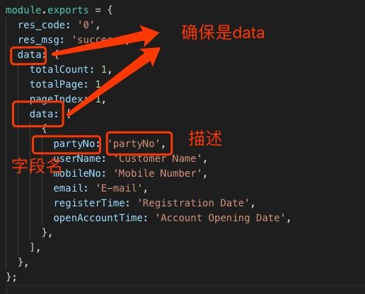
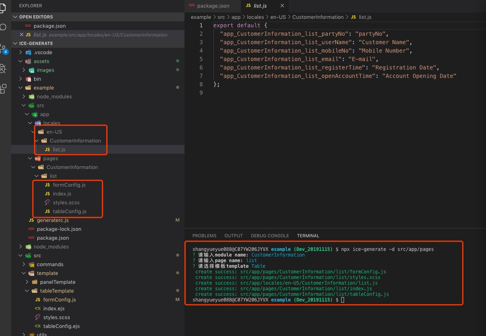

## ice-generate

### 功能介绍

基于接口文档，自动化构建动态页面，生成多语言配置，在此基础上，对数据进行定制化开发，提高开发效率

### 使用方法

#### 第一步

在跟目录 generaterc.js 配置：  
以 table 为例  


#### 第二步

执行命令，既可以生成对应页面

```

\$ npx ice-generate -d src/app/pages

or

$ yarn add ice-generate --dev

"scripts": {
"ice-generate": "ice-generate -d src/app/pages"
},

$ npm run ice-generate

```
### 温馨提示：
在 locales/en-US/index.js 写入下列代码自动引入该目录下的文件  
```
const context = require.context('./', true, /\.js$/);
const modules = context.keys().reduce((datas, file) => {
  if (file === './index.js') return datas;
  const fileDatas = context(file).default;
  return { ...datas, ...fileDatas };
}, {});
export default modules;
```

### 成果展示：


